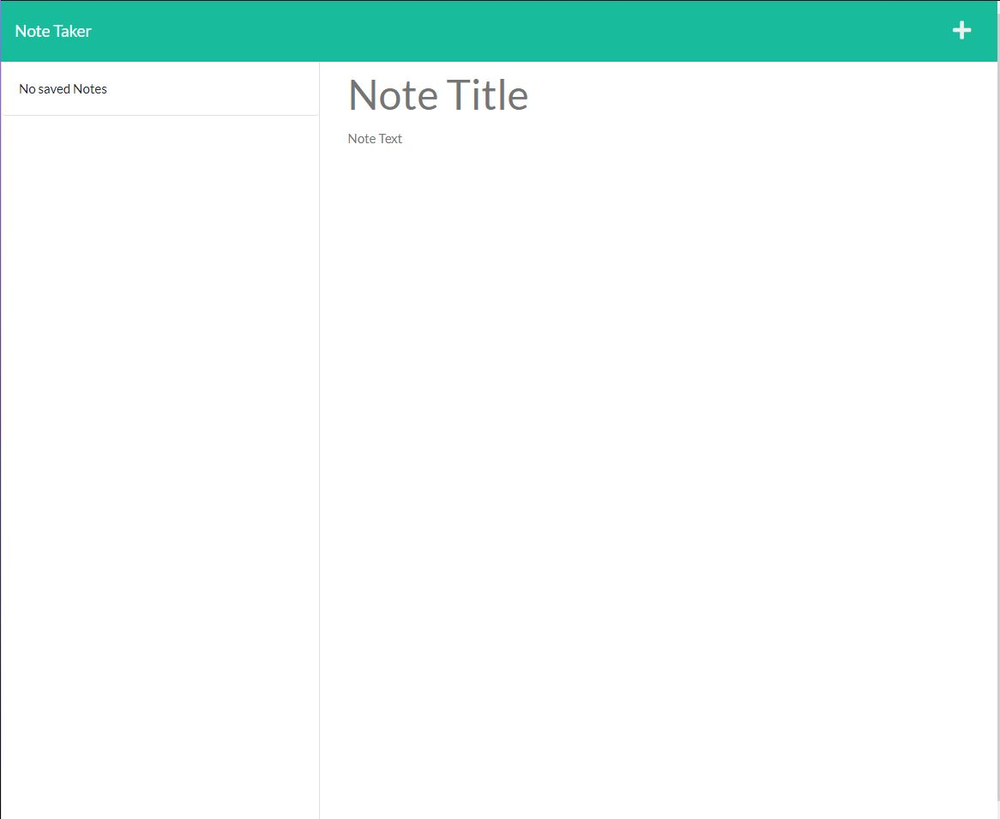

  # Noteinator

  ## Description:

  ### Noteinator is a simple note taking web application. You can use it to write, store and delete notes to the server to keep for later.

  ### https://noteinator.herokuapp.com

  

  ## Table of Contents:
  ###  * [Installation](#installation)
  ###  * [Usage](#usage)
  ###  * [Reach Out](#reach)
  ###  * [License](#license)
  ## Installation Instructions:
  ### Requires Node.js, Express.js and uuid
  ## Usage:
  ### Launch the site from the Heroku link and just follow the simple to understand UI to create, save and delete notes.
  ## Reach Out:
  ### Github: https://github.com/vsmith95
  ### or
  ### Email: vaughnsmith95@gmail.com

  ## License: MIT  
